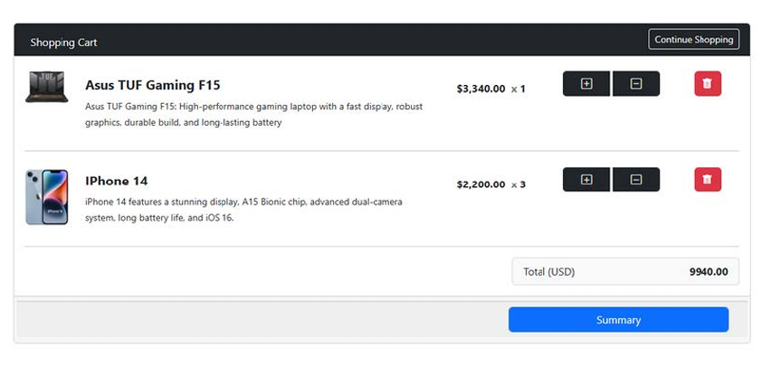
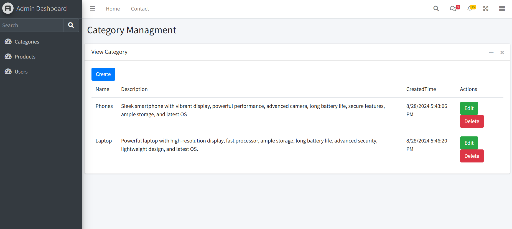

# E-Commerce Platform

  




## Table of Contents

- [Overview](#overview)
- [Features](#features)
- [Getting Started](#getting-started)
  - [Prerequisites](#prerequisites)
  - [Installation](#installation)
- [Usage](#usage)
- [Code Structure](#code-structure)
- [License](#license)

## Overview

E-Commerce Platform is a full-featured web application for managing an online store, built using ASP.NET MVC and Entity Framework. It includes product browsing, a shopping cart, user accounts, order placement, and an admin dashboard for inventory and order management. The system follows a clean, layered architecture to ensure scalability and maintainability.

## Features

- **Product Catalog**: Browse products by categories with image previews and price details.
- **Search & Filter**: Quickly find products using search and category filters.
- **Shopping Cart**: Add, remove, and update products in the cart with live cart tracking.
- **User Authentication**: Login/register functionality with role-based access control.
- **Checkout System**: Place orders with automatic order history tracking.
- **Admin Dashboard**: Admins can add/edit/delete products and view/manage orders.
- **Inventory Management**: Track stock levels for each product.

## Getting Started

### Prerequisites

- Visual Studio 2019 or later
- .NET Framework 4.7.2 or higher
- SQL Server or LocalDB instance

### Installation

1. **Clone the Repository**
   ```bash
   git clone https://github.com/Honda1010/E-Commerce_Platform.git
   cd E-Commerce_Platform
   ```
2. **Open the Project**

   ```
   Launch `E-Commerce_Platform.sln` in Visual Studio

   ```

3. **Set Startup Project**

   ```
   Right-click `MyShop.Web` → **Set as Startup Project**

   ```

4. **Update Database Connection**

   ```
   In `Web.config`, replace the connection string with your own SQL Server instance
   ```

5. **Run the Application**
   ```
   Press `F5` or `Ctrl+F5` in Visual Studio to build and launch the app
   ```

## Usage

- **Browse Products**: Navigate by category or search bar to explore the catalog.
- **Add to Cart**: Use the “Add to Cart” button to add products.
- **Cart Management**: View cart, update quantities, or remove items.
- **Checkout**: Place an order after logging in or registering.
- **Admin Panel**: If logged in as admin, manage inventory and orders.

## Code Structure

- **MyShop.Web**  
  ASP.NET MVC application – contains UI, controllers, and views.

- **MyShop.DataAccess**  
  Handles data access logic, Entity Framework context, and repositories.

- **MyShop.Entities**  
  Contains all model/entity classes used across the application.

- **MyShop.Utilities**  
  Helper classes, constants, and shared utilities.

## License

This project is licensed under the MIT License. See the [LICENSE](LICENSE) file for details.
